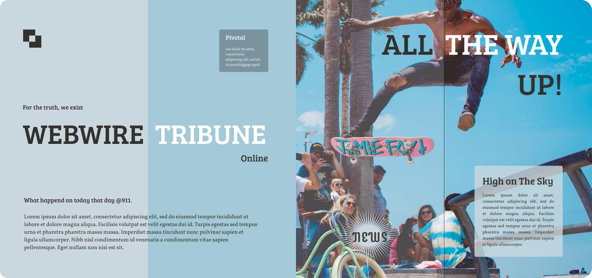

<h2 align="center">WebWire Tribune</h2>

<i>For the truth, we exist!</i>

---

## About Us

 WebWire Tribune online is a web news portal based on reliable source for accurate and up-to-date news from around the world. The webApp is developed with Laravel, PHP and Supabase.

### Features

- Simple, fast web surfing.
- Secure User Authentication.
- Efficient Article Management
- Responsive Design for Accessibility
- Insightful Analytics Integration
- Notification and email system.
## License

The project is open-sourced software licensed under the [MIT license](https://opensource.org/licenses/MIT).
